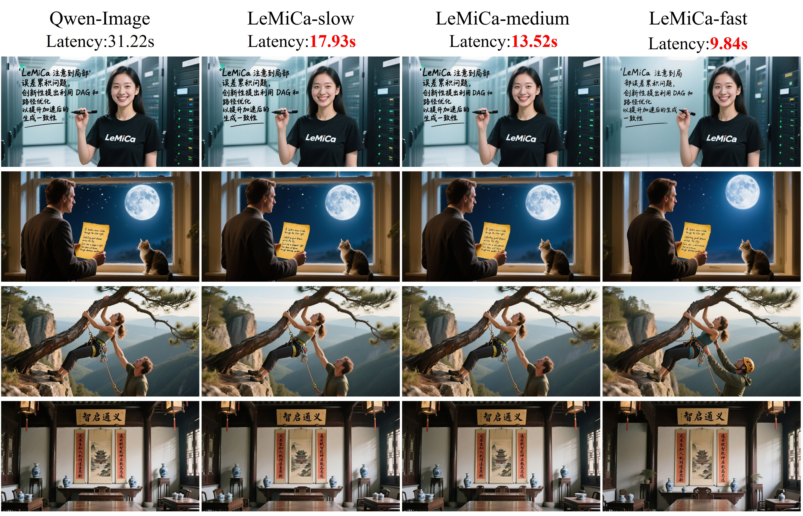

📚English | <a href="./README_CN.md">📚中文阅读 </a> 

<div align="center">
<!-- &nbsp; -->

</div>


# [NeurIPS 2025 Spotlight] LeMiCa: Lexicographic Minimax Path Caching for Efficient Diffusion-Based Video Generation

<div class="is-size-5 publication-authors" align="center">
  <span class="author-block">
    <a href="https://github.com/joelulu" target="_blank">Huanlin Gao</a><sup>1,2</sup><sup>*</sup>,&nbsp;
  </span>
  <span class="author-block">
    <a href="https://scholar.google.com/citations?hl=zh-CN&view_op=list_works&user=gpNOW2UAAAAJ" target="_blank">Ping Chen</a><sup>1,2</sup><sup>*</sup>,&nbsp;
  </span>
  <span class="author-block">
    <a href="https://github.com/stone002" target="_blank">Fuyuan Shi</a><sup>1,2</sup>,&nbsp;
  </span>
  <span class="author-block">
    <a href="https://github.com/tanchaow" target="_blank">Chao Tan</a><sup>1,2</sup>,&nbsp;
  </span>
  <span class="author-block">
    <a href="https://scholar.google.com/citations?hl=en&user=L4OXOs0AAAAJ" target="_blank">Zhaoxiang Liu</a><sup>1,2</sup>
  </span>
  <br>
  <span class="author-block">
    <a href="https://github.com/FangGet" target="_blank">Fang Zhao</a><sup>1,2</sup><sup>†</sup>,&nbsp;
  </span>
  <span class="author-block">
    <a href="https://scholar.google.com/citations?user=CFUQLCAAAAAJ&hl=en" target="_blank">Kai Wang</a><sup>1,2</sup>,&nbsp;
  </span>
  <span class="author-block">
    <a href="https://scholar.google.com.hk/citations?user=kCC2oKwAAAAJ&hl=zh-CN&oi=ao" target="_blank">Shiguo Lian</a><sup>1,2</sup>
  </span>
</div>

<div class="is-size-5 publication-authors" align="center">
  <span class="author-block"><sup>1</sup>Data Science & Artificial Intelligence Research Institute, China Unicom,&nbsp;</span>
  <span class="author-block"><sup>2</sup>Unicom Data Intelligence, China Unicom</span>
</div>

<div class="is-size-5 publication-authors" align="center">
  (* Equal contribution. † Corresponding author.)
</div>

<h5 align="center">

<a href="https://unicomai.github.io/LeMiCa/" target="_blank">
  
</a>
<!-- <a href="https://github.com/UnicomAI/LeMiCa" target="_blank">
  
</a> -->
<a href="https://arxiv.org/abs/2511.00090" target="_blank">
  
</a>
<!-- <a href="https://github.com/UnicomAI/LeMiCa/raw/main/assets/LeMiCa_NeurIPS2025_appendix.pdf" target="_blank">
  
</a> -->
</a>
<a href="./LICENSE" target="_blank">
  
</a>
<a href="https://github.com/UnicomAI/LeMiCa/stargazers" target="_blank">
  
</a>

</h5>


## Introduction

**LeMiCa** is a training-free acceleration framework for diffusion-based video generation (and extendable to image generation). Instead of using local heuristic thresholds, LeMiCa formulates cache scheduling as a global path optimization problem with error-weighted edges and introduces a Lexicographic Minimax strategy to bound the worst-case global error. This global planning improves both inference speed and consistency across frames. For more details and visual results, please visit our [project page](https://unicomai.github.io/LeMiCa/).


## 🔥 Latest News
- [2025/11/14] ⭐ We have open-sourced [**Awesome-Acceleration-GenAI**](https://github.com/joelulu/Awesome-Acceleration-GenAI), collecting the latest generation acceleration techniques. Feel free to check it out !
- [2025/11/13] 🔥 Support [**Wan2.1**](https://github.com/UnicomAI/LeMiCa/tree/main/LeMiCa4Wan2.1) !
- [2025/11/07] 🔥 Support [**Qwen-Image**](https://github.com/UnicomAI/LeMiCa/tree/main/LeMiCa4QwenImage) and Inference Code Released !  
- [2025/10/29] 🚀 Code will be released soon !  
- [2025/09/18] ✨ Selected as a **NeurIPS 2025 Spotlight** paper.  
- [2025/09/18] ✨ Initial public release of LeMiCa. 

<!-- - [2025/10/20] 🔥 **Qwen-Image** (Text-to-Image) support added.   -->

##  Demo


### Wan2.1

<!-- | Model | Wan2.1 (latency min) | LeMiCa (B=25) | LeMiCa (B=20) | LeMiCa (B=17) | LeMiCa (B=14) |
|:------:|:--------------------:|:--------------:|:--------------:|:--------------:|:--------------:|
| **I2V 14B 480p** | $7.78$ | $5.01$ ($\mathbf{1.55\text{x}}$) | $4.44$ ($\mathbf{1.75\text{x}}$) | $3.62$ ($\mathbf{2.15\text{x}}$) | $3.24$ ($\mathbf{2.40\text{x}}$) | -->

https://github.com/user-attachments/assets/3d99b959-7253-47ec-af0a-da13a66e6d49


### Open-Sora

https://github.com/user-attachments/assets/ba205856-2d77-494a-aaa9-09189ba2915c

<!-- <div style="width:85%;max-width:1000px;margin:0 auto;">
  <video
    src="https://github.com/user-attachments/assets/ba205856-2d77-494a-aaa9-09189ba2915c"
    controls
    autoplay
    loop
    muted
    style="width:100%;height:auto;display:block;margin:10px auto 4px auto;border-radius:12px;box-shadow:0 2px 10px rgba(0,0,0,0.15);"
  ></video>
  <p align="center" style="font-size:14px;color:gray;">
    Example generated by LeMiCa on Open-Sora (Text-to-Video)
  </p>
</div> -->


### Qwen-Image
<div style="width:85%;max-width:1000px;margin:0 auto;">
  <!-- 图片：无边框，宽度与上面表头一致 -->
  
</div>


##  Supported Models
LeMiCa currently supports and has been tested on the following diffusion-based models:  

**Text-to-Video**
- [Open-Sora](https://github.com/hpcaitech/Open-Sora)  
- [Latte](https://github.com/Vchitect/Latte)  
- [CogVideoX 1.5](https://github.com/THUDM/CogVideo)  
- [Wan2.1](https://github.com/Wan-Video/Wan2.1)  

**Text-to-Image**
- [Qwen-Image](https://github.com/QwenLM/Qwen-Image)  

- [FLUX.1](https://github.com/black-forest-labs/flux) 


## ToDo List
- 🗹 Public Project Page  
- 🗹 Paper Released  
- ☐ Text-to-Image Forward Inference  
- ☐ Text-to-Video Forward Inference  
- ☐ DAG Construction Code  
- ☐ Support Acceleration Framework   


## Acknowledgement
This repository is built based on or inspired by the following open-source projects:  [Diffusers](https://github.com/huggingface/diffusers), [Qwen-Image](https://github.com/QwenLM/Qwen-Image), [TeaCache](https://github.com/ali-vilab/TeaCache), [VideoSys](https://github.com/NUS-HPC-AI-Lab/VideoSys).
We sincerely thank these communities for their open contributions and inspiration.


## License
The majority of this project is released under the **Apache 2.0 license** as found in the [LICENSE](./LICENSE) file.


## 📖 Citation
If you find **LeMiCa** useful in your research or applications, please consider giving us a star ⭐ and citing it by the following BibTeX entry:

```bibtex
@inproceedings{gao2025lemica,
  title     = {LeMiCa: Lexicographic Minimax Path Caching for Efficient Diffusion-Based Video Generation},
  author    = {Huanlin Gao and Ping Chen and Fuyuan Shi and Chao Tan and Zhaoxiang Liu and Fang Zhao and Kai Wang and Shiguo Lian},
  journal   = {Advances in Neural Information Processing Systems (NeurIPS)},
  year      = {2025},
  url       = {https://arxiv.org/abs/2511.00090}
}
```